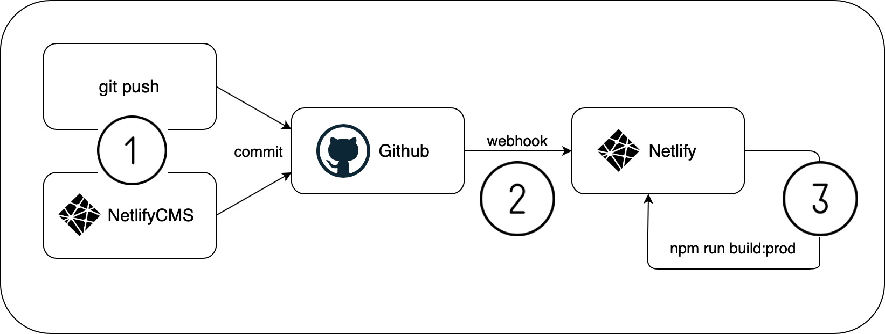

# Overview

This repo contains the source code for sport-entspannungstherapie.de, a website for a local Berlin massage therapist.

## Production setup



1. The source code is hosted on Github, updates can be made either by `git push` or through the NetlifyCMS web interface (`domain.com/admin/`)
2. A push to master on Github notifies Netlify about new changes
3. Netlify pulls the latest changes from Github and runs the specified build command before re-deploying

## Tools and technologies

**static site builder**

The main work of processing nunjucks templates and javascript or markdown data files is handled by [11ty](https://www.11ty.dev/docs/).

**CSS framework**

[TailwindCSS](https://tailwindcss.com) is used as a [PostCSS](https://postcss.org) plugin to generate all css for the site. The css is the only thing not generated by 11ty but by postcss (see `package.json` `build:prod` script).

## Honorable mentions

- When the source directory changes, this change needs to be reflected in `package.json`, `.eleventy.js`, and `admin/config.yml`
- 11ty doesn't process assets, they need to be copied over manually (see `.eleventy.js`)
- Collections (like `services/*.md`) get their own html page in the output folder [unless told otherwise](https://github.com/mmlkrx/sport-entspannungstherapie.de/commit/afa43eb3fe75ed96e511d0cf499b4bbebfa825c6)
- For the production build, the postcss plugin purgecss removes all css styles that aren't used. So when the css looks whacky, check if purgecss is ignoring some files with css classes that it shouldn't

# How to make changes

All changes should be made inside the `site/` directory. This is where all source files are. The `site/` directory can not be deployed, instead, the `npm run build:prod` command will generate a new `_site/` directory from the files inside `site/` and that directory should be deployed. To make the build command work, first install all necessary javascript libraries:

```shell
npm install
```

It's now possible to make changes to files inside `site/` and run `npm run build:prod` to generate `_site/`. A more typical approach however, is to run a local server that watches files inside `site/` automatically and regenerates `_site/` every time you make a change so you can preview changes locally in the browser before moving `_site/` to a server.

To start a local development server, run the following commands:

```shell
npm run build:dev
npm run dev
```

You can now start changing files in `site/` and see the changes in your browser at `http://localhost:8080`.

# Glossary

**_site/**

The output directory for our static site generator 11ty. This is the directory that will be served by a webserver. Generate this directory by running `npm run build:prod`

**site/**

The input directory containing all project source files. Edit the files in here and run the build command to generate `_site/`.

**.eleventy.js**

The configuration file for 11ty. Necessary to process all project files and create the final output directory.

**.gitignore**

This file tells our source code management software Git which files or directories not to track.

**package.json**

This file contains the javascript libraries necessary for this project as well as build scripts.

**postcss.config.js**

The configuration for postcss which compiles all css files.

**setup.xml**

Source file for setup.jpg, can be edited and regenerated by importing and editing at [draw.io](https://www.draw.io).

**tailwind.config.js**

The configuration file for TailwindCSS, a css framework.
